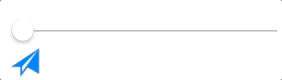
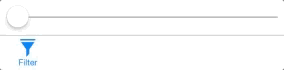

# DYBadge

[](http://cocoapods.org/pods/DYBadge)
[](http://cocoapods.org/pods/DYBadge)
[](http://cocoapods.org/pods/DYBadge)
[](https://github.com/Carthage/Carthage)


 DYBadge (written in Swift) is a UILabel subclass that can be added as subview to any UIView and its subclasses (except for UIImageView). If the string value of the badge changes from nil (or "nullish") to a valid string value at runtime the badge will appear with a pop up effect. If it switches back to a "nullish" value, it will shrink and disappear.
The class also includes a UIButton  class function (extension) to create a button with an image and a title, which is positioned underneath the image. 
**since version 2.0, the xOffset and yOffset values have been removed, as well as badgeFont, badgeColor and badgeTextColor. Simply use the UILabel properties to set these values (don't use badge.text directly!).**

## Example

To checkout the example project, simply clone the repo or download the zip file. 

## Features

* Create in code or get a UILabel in Interface Builder and change its class to DYBadge 
* UIDesignable class with badgeString as UIInspectable
* Create a UIButton with image and a button title placed underneath the image and add a DYBadge (see the extension).

## Installation


Installation through Cocoapods or Carthage is recommended. 

Carthage: Simply add the following line to your Cartfile.

github "DominikButz/DYBadge" ~> 2.0

Check out the version history below for the current version.

Afterwards, run "carthage update DYBadge --platform iOS" in the root directory of your project. Follow the steps described in the carthage project on github (click on the carthage compatible shield above). 

Alternatively, install through Cocoapods:

target '[project name]' do
 	pod 'DYBadge', '~> 2.0
end

Make sure to import DYBadge into your View Controller subclass:

```Swift
import DYBadge
```

## Usage

Check out the following examples. 

### Code example: Creating a button with a DYBadge


```Swift
 @IBOutlet weak var firstButton: UIButton! 
 

 override func viewDidLoad() {
   super.viewDidLoad()
   

     let frame = CGRect(x: self.firstButton.frame.size.width - 3.0, y: -5.0, width: 8.0, height: 5.0)
        let firstBadge = DYBadge(frame: frame)
        
   let font = UIFont(name: "HelveticaNeue-Bold", size: 10.0)!   
   firstBadge.font = font
   firstBadge.backgroundColor = UIColor.red
   firstBadge.textColor = UIColor.white
   
 // set a start value if required
   firstBadge.badgeString = "7"
   
   self.firstButton.addSubview(firstBadge)

  
   
 }

```

 

### Code example: Creating a button with image and title

 
```Swift

 @IBOutlet weak var secondButtonItem: UIBarButtonItem!

 override func viewDidLoad() {
	    super.viewDidLoad()
	    
	     let buttonFrame =  CGRect(x: 0, y: 0, width: 25.0, height: 26.0)
    
        let filterButton  = UIButton.createImageTitleButton(image:  imageLiteral(resourceName: "filterButton"), title: "Filter", font: font, frame: buttonFrame, tintColor: self.view.tintColor)      // see extension
	        
		 let secondBadge = DYBadge(frame: secondBadgeFrame)
       secondBadge.backgroundColor = self.view.tintColor
       secondBadge.textColor = UIColor.white
       secondBadge.font = font
       filterButton.addSubview(secondBadge)

       self.secondButtonItem.customView = filterButton
	}
```
 

## Change log
#### [Version 2.0.1](https://github.com/DominikButz/DYBadge/releases/tag/2.0.1)
source file path correction in podspec file.
#### [Version 2.0](https://github.com/DominikButz/DYBadge/releases/tag/2.0)
xOffset and yOffset values have been removed, as well as badgeFont, badgeColor and badgeTextColor. Simply use the UILabel properties (font, color, backgroundColor) to set these values.
#### [Version 1.1.1](https://github.com/DominikButz/DYBadge/releases/tag/1.1.1)
Minor build fix.
#### [Version 1.1](https://github.com/DominikButz/DYBadge/releases/tag/1.1)
The badge is now placed by default at the origin of the superview. Adjust your offsetX and offsetY values accordingly - see the example above. 
#### [Version 1.0.3](https://github.com/DominikButz/DYBadge/releases/tag/1.0.3)
public header fix for carthage
#### [Version 1.0.2](https://github.com/DominikButz/DYBadge/releases/tag/1.0.2)
adding podfile, readme update

#### [Version 1.0.1](https://github.com/DominikButz/DYBadge/releases/tag/1.0.1)
missing source files in example - fix

#### [Version 1.0](https://github.com/DominikButz/DYBadge/releases/tag/1.0)
see deprecated project DYBadgeButton for previous versions. 


## Author

dominikbutz@gmail.com

## License

DYBadge is available under the MIT license. See the LICENSE file for more info.


